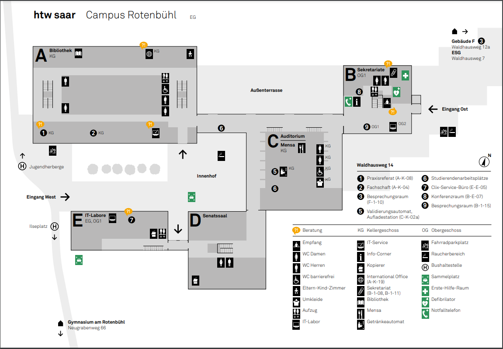

<html lang="de">
<head>
    <meta charset="UTF-8">
    <meta name="viewport" content="width=device-width, initial-scale=1.0">
    <title>Campus-Übersicht</title>
    
</head>
<body>
    <header>
        <h1>Campus-Übersicht Rotenbühl</h1>
    </header>

    <section>
        <h2>Campus Rotenbühl</h2>
        
Willkommen auf dem Campus Rotenbühl der HTW Saar!

        <h3>Übersichtsplan</h3>
        

        
Für detaillierte Informationen besuchen Sie die offizielle <a href="https://www.htwsaar.de/hochschule/standorte-und-kontakt/campus-rotenbuehl/uebersichtsplan-campus-rotenbuehl/uebersichtsplan-campus-rotenbuehl" target="_blank">HTW Saar Seite</a>.

    </section>
</body>
<html lang="de">
<head>
  
</head>
<body>
    <header>
      
    </header>

    <section>
      
    </section>

    <footer>
        <h2>Kontakt</h2>
        <address>
            

                Hochschule für Technik und Wirtschaft des Saarlandes 
                Goebenstraße 40 
                66117 Saarbrücken
            

            

                Telefon: (0681) 58 67 - 0 
                Telefax: (0681) 58 67 - 122 
                E-Mail: <a href="mailto:info@htwsaar.de">info@htwsaar.de</a>
                
Erstellt von Joshua Perty und Dennis Andruskevic

